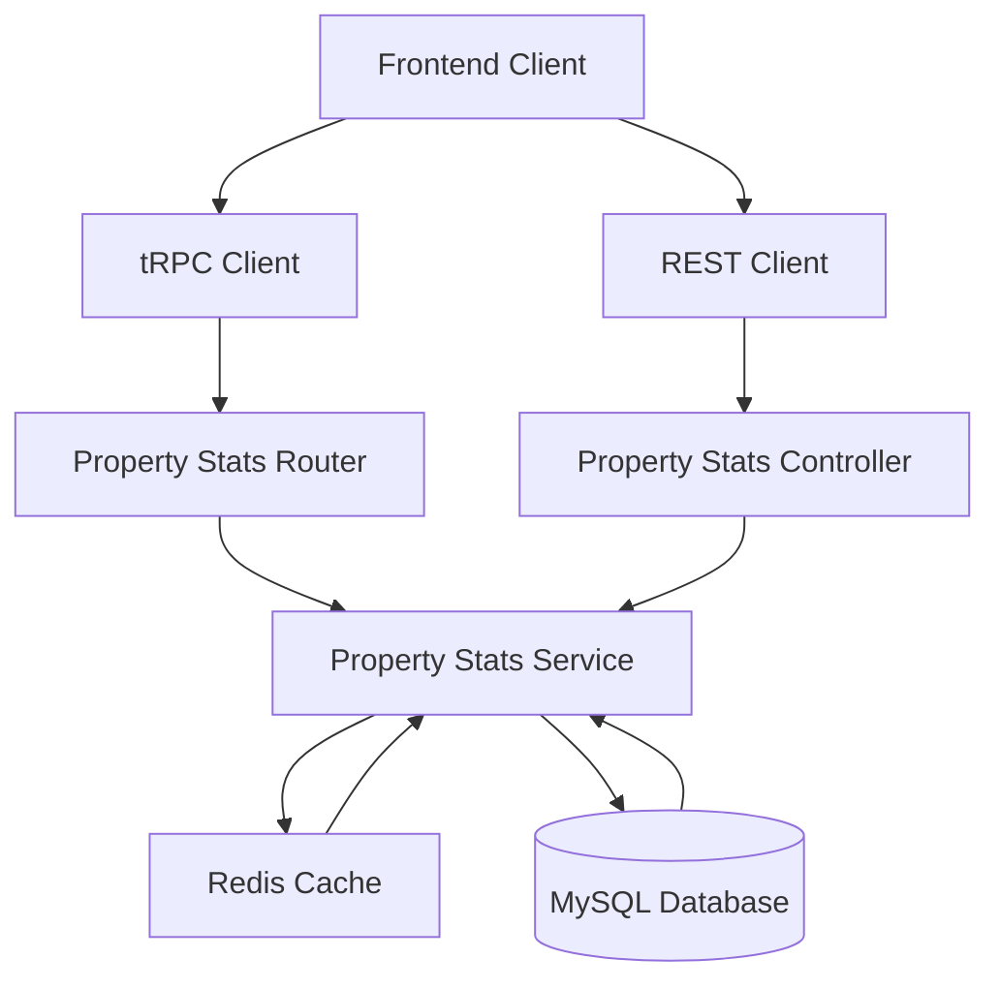

# System Design Document

## Property Statistics API

### Overview

The Property Statistics API provides aggregated statistical data for properties based on regional queries. This API will be implemented as both a tRPC procedure and REST endpoint, following QRent's existing architectural patterns. The API calculates statistics including average room prices, commute times, property counts, and average property prices for specified regions.

### Architecture

#### High-Level Architecture



#### Request Flow

1. **Client Request**: Frontend sends region query (space-separated string)
2. **Input Validation**: Validate and sanitize region parameters
3. **Cache Check**: Check Redis for cached statistics
4. **Database Query**: If cache miss, execute aggregated queries
5. **Data Processing**: Calculate statistics and format response
6. **Cache Store**: Store results in Redis with appropriate TTL
7. **Response**: Return formatted statistics to client

### Components and Interfaces

#### 1. tRPC Router (`/trpc/routers/propertyStats.ts`)

```typescript
// Input Schema
const propertyStatsInputSchema = z.object({
  regions: z
    .string()
    .regex(/^[a-z-]+(\s[a-z-]+)*$/)
    .optional()
    .describe("Space-separated region names")
});

// Output Schema
const regionStatsSchema = z.object({
  regionName: z.string(),
  avgPricePerRoom: z.number().nullable(),
  avgCommuteTime: z.number().nullable(), 
  totalProperties: z.number(),
  avgPropertyPrice: z.number().nullable()
});

const propertyStatsResponseSchema = z.object({
  regions: z.array(regionStatsSchema),
  timestamp: z.date(),
  cacheHit: z.boolean()
});

// tRPC Procedure
export const propertyStatsRouter = t.router({
  getStats: publicProcedure
    .input(propertyStatsInputSchema)
    .output(propertyStatsResponseSchema)
    .query(async ({ input }) => {
      return await propertyStatsService.getRegionalStats(input.regions);
    })
});
```

#### 2. REST Controller (`/controllers/propertyStatsController.ts`)

```typescript
export class PropertyStatsController {
  async getStats(req: Request, res: Response) {
    try {
      const { regions } = req.query;
      const stats = await propertyStatsService.getRegionalStats(regions as string);
      res.json(stats);
    } catch (error) {
      // Error handling
    }
  }
}
```

#### 3. Property Statistics Service (`/services/PropertyStatsService.ts`)

```typescript
export class PropertyStatsService {
  async getRegionalStats(regionsInput?: string): Promise<PropertyStatsResponse> {
    // Parse and validate regions
    const regions = this.parseRegions(regionsInput);
    
    // Check cache
    const cacheKey = this.generateCacheKey(regions); // make sure strings with same order but in different order still hit the same cache
    const cached = await this.getCachedStats(cacheKey);
    if (cached) return cached;
    
    // Query database for statistics
    const stats = await this.calculateRegionalStats(regions);
    
    // Cache results
    await this.cacheStats(cacheKey, stats);
    
    return stats;
  }
  
  private async calculateRegionalStats(regions: string[]): Promise<RegionStats[]> {
    // Execute database queries for each region
  }
}
```

### Data Models

#### Database Schema Analysis

Based on the existing Prisma schema:

- **Properties Table**: Contains `price`, `bedroomCount`, `regionId`
- **Regions Table**: Contains `name`, linked to properties
- **PropertySchool Junction**: Contains `commuteTime` for property-school relationships

#### Statistical Calculations

Use Prisma ORM to perform the following calculations:

1. **Average Price per Room**: 
   ```sql
   SELECT AVG(price / NULLIF(bedroom_count, 0)) as avg_price_per_room
   FROM properties p
   JOIN regions r ON p.region_id = r.id
   WHERE r.name LIKE 'region%'
   AND bedroom_count > 0
   ```

2. **Average Commute Time**:
   ```sql
   SELECT AVG(ps.commute_time) as avg_commute_time
   FROM property_school ps
   JOIN properties p ON ps.property_id = p.id  
   JOIN regions r ON p.region_id = r.id
   WHERE r.name LIKE 'region%'
   AND ps.commute_time IS NOT NULL
   ```

3. **Total Properties**:
   ```sql
   SELECT COUNT(*) as total_properties
   FROM properties p
   JOIN regions r ON p.region_id = r.id
   WHERE r.name LIKE 'region%'
   ```

4. **Average Property Price**:
   ```sql
   SELECT AVG(price) as avg_property_price
   FROM properties p
   JOIN regions r ON p.region_id = r.id
   WHERE r.name LIKE 'region%'
   ```

#### Response Data Structure

```typescript
interface RegionStats {
  regionName: string;
  avgPricePerRoom: number | null;
  avgCommuteTime: number | null;
  totalProperties: number;
  avgPropertyPrice: number | null;
}

interface PropertyStatsResponse {
  regions: RegionStats[];
  timestamp: Date;
  cacheHit: boolean;
}
```

### Error Handling

#### Error Types and Responses

1. **Input Validation Errors (400)**
   ```typescript
   {
     error: "VALIDATION_ERROR",
     message: "Invalid region format",
     details: "Regions must contain only lowercase letters and hyphens"
   }
   ```

2. **Database Connection Errors (500)**
   ```typescript
   {
     error: "DATABASE_ERROR", 
     message: "Unable to retrieve statistics",
     timestamp: "2024-01-01T00:00:00Z"
   }
   ```

3. **Timeout Errors (504)**
   ```typescript
   {
     error: "TIMEOUT_ERROR",
     message: "Request timeout while calculating statistics"
   }
   ```

#### Error Handling Strategy

- **Input Validation**: Use Zod schemas for type-safe validation
- **Database Errors**: Catch Prisma errors and convert to generic HTTP errors
- **Logging**: Use structured logging for debugging
- **Fallback**: Return partial results if some regions fail

### Caching Strategy

#### Redis Cache Implementation

```typescript
class PropertyStatsCacheService {
  private readonly TTL = 3600; // 1 hour
  
  async getCachedStats(cacheKey: string): Promise<PropertyStatsResponse | null> {
    const cached = await redis.get(cacheKey);
    return cached ? JSON.parse(cached) : null;
  }
  
  async cacheStats(cacheKey: string, stats: PropertyStatsResponse): Promise<void> {
    await redis.setex(cacheKey, this.TTL, JSON.stringify(stats));
  }
  
  generateCacheKey(regions: string[]): string {
    return `property-stats:${regions.sort().join(':')}`;
  }
  
  async invalidateStatsCache(): Promise<void> {
    const keys = await redis.keys('property-stats:*');
    if (keys.length > 0) {
      await redis.del(...keys);
    }
  }
}
```

#### Cache Invalidation

- **Time-based**: 1-hour TTL for statistical data
- **Event-based**: Invalidate when properties are added/updated
- **Manual**: Admin endpoint to clear cache

### Performance Optimizations

#### Database Query Optimization

1. **Single Query Approach**: Use SQL UNION or subqueries to fetch all statistics in one database round-trip
2. **Indexes**: Leverage existing indexes on `regionId`, `price`, `bedroomCount`
3. **Query Batching**: Process multiple regions in a single query

#### Optimized Database Query

```sql
-- Combined statistics query
SELECT 
  r.name as region_name,
  AVG(p.price / NULLIF(p.bedroom_count, 0)) as avg_price_per_room,
  AVG(ps.commute_time) as avg_commute_time,
  COUNT(DISTINCT p.id) as total_properties,
  AVG(p.price) as avg_property_price
FROM regions r
LEFT JOIN properties p ON r.id = p.region_id
LEFT JOIN property_school ps ON p.id = ps.property_id
WHERE r.name IN (${regions})
GROUP BY r.id, r.name
```

### Testing Strategy

#### Unit Tests

1. **Service Layer Tests**
   - Test statistical calculations with mock data
   - Test region parsing and validation
   - Test cache hit/miss scenarios
   - Test error handling for invalid inputs

2. **Database Query Tests**
   - Test query accuracy with known datasets
   - Test edge cases (zero bedrooms, null commute times)
   - Test performance with large datasets

#### Integration Tests

1. **API Endpoint Tests**
   - Test tRPC procedure with various inputs
   - Test REST endpoint compatibility
   - Test authentication requirements
   - Test response format validation

2. **Cache Integration Tests**
   - Test cache storage and retrieval
   - Test cache invalidation
   - Test fallback behavior when cache fails

#### Performance Tests

1. **Load Testing**: Test with high concurrency (100+ requests)
2. **Data Volume Testing**: Test with large property datasets
3. **Response Time Testing**: Ensure sub-2-second response times

### Integration Points

#### Existing System Integration

1. **Property Service**: Reuse region parsing logic from existing property search
2. **Authentication**: Optional authentication for rate limiting
3. **Error Handling**: Follow existing `HttpError` patterns
4. **Logging**: Use existing logging infrastructure

#### API Registration

```typescript
// tRPC Router Registration
import { propertyStatsRouter } from './routers/propertyStats';

export const appRouter = t.router({
  auth: authRouter,
  users: usersRouter,  
  properties: propertiesRouter,
  propertyStats: propertyStatsRouter, // New router
});

// REST Route Registration  
app.use('/api/property-stats', propertyStatsRoutes);
```

### Security Considerations

1. **Input Sanitization**: Validate region strings to prevent SQL injection
2. **Rate Limiting**: Implement rate limiting to prevent abuse
3. **Authentication**: Optional JWT authentication for premium features
4. **Data Privacy**: Ensure no sensitive property owner information is exposed

### Monitoring and Observability

1. **Metrics**: Track response times, cache hit rates, error rates
2. **Logging**: Log all requests with region parameters and response times
3. **Alerts**: Set up alerts for high error rates or slow response times

This design provides a robust, scalable solution that integrates seamlessly with the existing QRent architecture while meeting all the requirements specified in the requirements document.